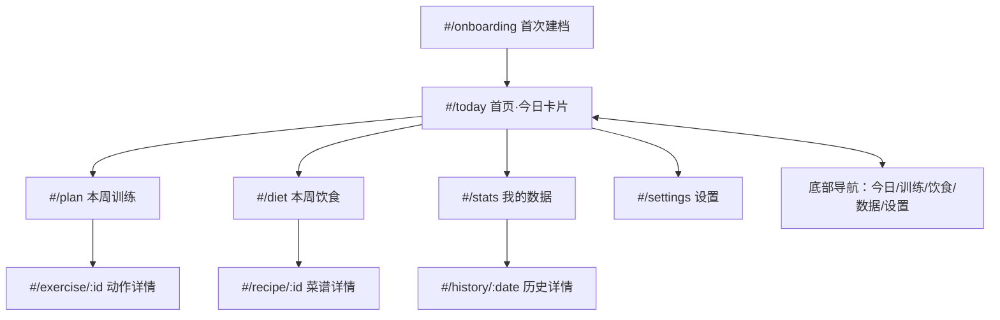

# 04 - 设计规范（P4 设计方案）

- 日期：2026-08-14
- 产品：健身助手（移动优先 Web）
- 方法：ui-ux-pro-max 定风格 + design-system 三层 token + better-* 逐项检查

## 1. 设计方向

**一句话**：清爽健康的移动优先卡片式界面——浅色为主、绿色为品牌色、琥珀色表达"坚持"、大按钮、圆角卡片、无多余装饰。

- 情绪关键词：健康、清爽、有活力、可信、轻松坚持
- 风格基线：Minimal + 轻 Claymorphism（柔和圆角卡片 + 极淡阴影，避免玩具感）
- 图标：内联 SVG（Lucide/Heroicons 风格），线宽 1.8，默认 24px；**禁用 emoji 充当图标**

## 2. 信息架构与页面

### 2.1 页面路由（SPA hash 路由）



### 2.2 底部导航（≤5 项）

`今日`（首页）｜`训练`（本周训练）｜`饮食`（本周饮食）｜`数据`（统计）｜`设置`

- 高 56px + 底部安全区 `env(safe-area-inset-bottom)`
- 选中态：绿色图标 + 绿字 + 顶部 2px 指示条；未选中：灰色
- 动作详情/菜谱详情/历史详情为二级页：隐藏底导，左上角返回

### 2.3 关键页面线框

**#/today 首页·今日卡片**（从上到下）
```
┌─────────────────────────────┐
│ 🔥 连续坚持 12 天        [周目标] │  ← 顶部条（琥珀色数字）
├─────────────────────────────┤
│ 今日训练      [已完成 ✓]      │  ← 绿色主题卡片
│ 主题：胸 + 三头               │
│ ① 杠铃卧推  4组 × 10次  ▶    │
│ ② 上斜哑铃推举 3组 × 12次 ▶   │
│ ③ 绳索下压  3组 × 12次  ▶    │
│        [ 完成训练打卡 ]        │  ← 大按钮（绿色）
├─────────────────────────────┤
│ 今日菜单      [查看本周]       │  ← 饮食卡
│ 早餐 燕麦鸡蛋羹 420kcal [替换]│  ← 每餐：主菜+替换+打卡态
│ 午餐 香煎鸡胸饭 620kcal [吃了]│
│ 晚餐 番茄牛腩 480kcal  [没吃]│
│ 加餐 香蕉+坚果  180kcal [吃了]│
├─────────────────────────────┤
│ 体重：__ kg   [记录]  (可选)   │
└─────────────────────────────┘
```

**#/plan 本周训练**
```
周视图 7 天横滑（卡片），每天：主题标题 + 动作行（名/组×次/休息）
  行尾「▶」进动作详情；「＋」添加动作；长按/编辑模式增删改
```

**#/stats 我的数据**
```
┌ 连续坚持 N 天（大数字，琥珀色） ┐
├ 周完成率 3/4 天（进度环）     ┤
├ 月度日历（绿=完成 灰=计划未练 空=休息）┤
├ 体重曲线（折线图）            ┤
```

**#/onboarding 建档**：单列分步表单，每步 1 个问题组，底部「下一步」大按钮，顶部步骤指示条（1/6）。

## 3. 设计 Token（三层结构）

### 3.1 Primitive（原始色板）

| 变量 | 色值 | OKLCH 参考 | 用途 |
|---|---|---|---|
| --green-100 | `#E7F6EC` | oklch(0.965 0.032 155) | 成功/完成浅底 |
| --green-200 | `#C4E8D2` | oklch(0.9 0.062 155) | 选中浅底 |
| --green-500 | `#22A55B` | oklch(0.66 0.15 150) | 深色模式主色 |
| --green-700 | `#157A40` | oklch(0.53 0.12 150) | 浅色模式主色 |
| --green-800 | `#116D35` | oklch(0.47 0.11 150) | 按压态 |
| --amber-400 | `#F5A524` | oklch(0.8 0.15 75) | 深色模式坚持色 |
| --amber-700 | `#B45309` | oklch(0.52 0.13 55) | 浅色模式坚持色 |
| --ink-900 | `#18201C` | oklch(0.25 0.015 160) | 主文本 |
| --ink-600 | `#5A6660` | oklch(0.47 0.015 160) | 次要文本 |
| --ink-100 | `#E6EAE6` | oklch(0.92 0.008 160) | 分割线/边框 |
| --bg | `#FAFBF8` | oklch(0.985 0.004 160) | 浅色背景 |
| --card | `#FFFFFF` | — | 卡片 |
| --red-700 | `#B42318` | oklch(0.48 0.16 25) | 危险/错过 |
| --dark-bg | `#121714` | oklch(0.22 0.01 160) | 深色背景 |
| --dark-card | `#1A211D` | oklch(0.28 0.01 160) | 深色卡片 |
| --dark-ink | `#E8EDE9` | oklch(0.93 0.008 160) | 深色主文本 |
| --dark-ink-600 | `#9AA8A0` | oklch(0.7 0.02 160) | 深色次要文本 |
| --dark-border | `#2A342E` | oklch(0.34 0.012 160) | 深色边框 |

### 3.2 Semantic（语义层）

| 变量 | 浅色 | 深色 | 含义 |
|---|---|---|---|
| --color-bg | --bg | --dark-bg | 页面背景 |
| --color-card | --card | --dark-card | 卡片/浮层 |
| --color-text | --ink-900 | --dark-ink | 主文本 |
| --color-text-muted | --ink-600 | --dark-ink-600 | 次要文本 |
| --color-border | --ink-100 | --dark-border | 边框/分割线 |
| --color-primary | --green-700 | --green-500 | 主行动/成功 |
| --color-on-primary | `#FFFFFF` | `#0F1712` | 主按钮文字 |
| --color-primary-soft | --green-100 | oklch(0.3 0.05 150) | 完成/选中底 |
| --color-streak | --amber-700 | --amber-400 | 连续天数/火焰 |
| --color-danger | --red-700 | `#F87171` | 失败/错过/删除 |
| --color-on-danger | `#FFFFFF` | `#1A1200` | 危险按钮文字 |

**对比度已校验（WCAG AA 均达标）**：正文 16.02:1；次要文本 5.77:1；主按钮白字/绿底 5.40:1；深色模式正文 15.30:1、按钮深字/亮绿 5.73:1、琥珀/深底 8.88:1。

### 3.3 Component（组件层要点）

| 组件 | 规范 |
|---|---|
| 主按钮 | 高 48px，圆角 12px，底 `--color-primary`、字 `--color-on-primary`，按压变深（浅色→green-800），禁用 40% 不透明度 |
| 次按钮 | 白底 + 1px 边框，字 `--color-text`，按压底 `--ink-100` |
| 卡片 | 圆角 16px，白底/深色卡底，阴影 `0 1px 2px rgba(0,0,0,.04), 0 4px 12px rgba(0,0,0,.04)`，内边距 16px |
| 打卡按钮 | 圆形/胶囊，完成态绿色实心 + 白色对勾；未完成描边 |
| 餐次行 | 左：餐名+菜名+热量；右：状态胶囊（吃了/没吃/替换）+「替换」链接 |
| 底部导航 | 见 2.2 |
| 步骤条 | 6 段胶囊，当前段绿色，已完成绿色对勾，未到灰色 |
| 空态 | 图标 + 一句引导 + 主按钮 |
| 进度环 | 环形 48px，绿色，中央百分比 |
| 日历格 | 40px 方块；完成=绿色实心白字；计划未练=浅灰；休息=无底；今日=绿描边 |
| 体重曲线 | 折线图，绿色线 + 数据点，Y 轴自适应，无数据时显示空态 |

## 4. 字体与字号层级

- 品牌字体：`Varela Round`（展示数字/标题，营造亲和运动感）+ `Nunito Sans`（正文）
- 中文回退：`PingFang SC` → `Microsoft YaHei` → `Noto Sans SC` → `sans-serif`
- 加载：Google Fonts（woff2），失败自动回退系统字体，不影响功能

| 名称 | 字号/行高 | 字重 | 用法 |
|---|---|---|---|
| display | 28/34 | 700 | 连续天数大数字（tabular-nums） |
| h1 | 22/30 | 700 | 页面标题 |
| h2 | 18/26 | 700 | 卡片标题 |
| body | 16/24 | 400~600 | 正文/按钮（移动端输入≥16px 防 iOS 缩放） |
| caption | 13/18 | 500 | 辅助说明/标签 |
| badge | 12/16 | 600 | 胶囊状态，白字或绿字 |

- 数字一律 `font-variant-numeric: tabular-nums`
- 标题 `text-wrap: balance`；说明文字 `text-wrap: pretty`
- 正文行高 1.5，标题 1.1~1.3，超过 3 行文本行高 ≥1.4

## 5. 间距与布局栅格

- 基准 4px：`4/8/12/16/24/32/48`
- 页面左右边距：16px（移动端）；内容区最大宽 480px 居中（手机优先，桌面居中显示）
- 组内间距 8px，组间 ≥16px（组间距 ≥ 2× 组内间距）
- 卡片内边距 16px；卡片间距 12px
- 断点：375px（基准）/ 480px（内容封顶）/ 768px（平板双列可选）/ 1024px+（桌面居中，底导保留）
- 全文逻辑属性（padding-inline-start 等），不用物理 left/right

## 6. 动效与交互

- 过渡 150~250ms ease-out；按压反馈 200ms
- 打卡成功：轻量打勾弹跳（scale 1→1.08→1），尊重 `prefers-reduced-motion`
- 页面切换：淡入+上移 8px；返回 300ms 内
- 不启用无意义常驻动画；进度环/折线图动画 ≤600ms 一次

## 7. 无障碍（better-accessibility 检查项）

- 正文对比度 ≥4.5:1（已校验）；图标按钮带 aria-label
- 全部可点击元素：键盘可达 + 可见 focus 环（2px 绿框 + 2px 偏移）
- 表单：可见 label、错误就近提示（字段下方红字）、helper 文案
- 触控目标 ≥44×44px（主按钮 48px）
- 语义化 heading 层级：页面 h1 → 卡片 h2，无跳级
- 纯装饰图标 `aria-hidden`；日历格同时提供文本（如"8月14日 已完成"）

## 8. better-* 细化检查结论

| 检查 | 结论 |
|---|---|
| better-colors | ✅ 全部关键色对比度 AA 达标；语义 token 一色一义；深浅双模式逐一校验 |
| better-typography | ✅ 字号层级语义化；行高按角色；tabular-nums；16px 输入防缩放；中英混排回退 |
| better-layout | ✅ 空间优先分组；组距≥2×组内距；内容封顶 480px；安全区适配；控制与内容区分 |
| better-ui | ✅ 按压/悬停/禁用态齐备；SVG 图标统一；阴影极淡；动效克制且尊重 reduced-motion |
| better-accessibility | ✅ 对比度/焦点/标签/触控尺寸/语义层级 均达标 |

## 9. 关键页面说明（开发约束）

1. **首页今日卡片**为唯一主入口：训练/饮食/打卡/体重四件事一屏完成，卡片顺序固定
2. 二级页（动作/菜谱/历史）必须可返回且保留滚动位置
3. 建档页不可跳过；重进已建档用户直接进首页
4. 所有数据变化即时写入 localStorage 并提示"已保存"
